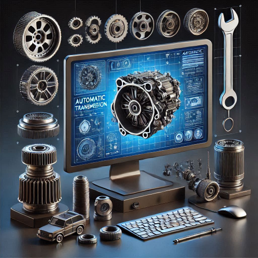

<h1 align="center">Hola 👋, Soy Richard de Transmix</h1>

Soy Tecnico Especialista en Transmisiones Automaticas, CVT, DSG, ZF, etc. Direcciones Hidraulicas, Electricas,en ocasiones tambien hago trabajos de Mecanica en General y resuelvo problemas con Módulos de TCM, PCM, red CAN entre otros problemas eléctricos que en ocasiones se presentan, atiendo la gran mayoría de marcas de vehiculos.

Tengo en el ramo Automotriz en la especialidad de Transmisiones Automaticas 25 años siempre desde mi adolecencia me intereso la Electricidad, Electronica, y leia bastante sobre eso pero a los 19 años empecé aprender cosas del ramo automotriz poco a poco primero con el funcionamiento de todos los sensores, lectura de diagramas a realizar diagnósticos con tablaS de diagnostico lleve cursos de tuneos, redes CAN, alarmas, Inmovilizadores eso alrededor 2004 hasta 2007 años después me pase a las ventas de partes de transmisiones automaticas y direcciones Hidraulicas estuve ahi como  10 años, cabe mencionar que mientras estuve en las ventas nunca deje de estudiarlas transmisiones automaticas leia Hidráulica, leia mucho sobre boletines técnicos sobre solución de fallos y diferencias entre transmisiones siempre me ha gustado la lectura, ya después en el 2012 re ingrese a la parte tecnica ya de forma mas permanente en la Reparaciones de Transmisiones Automaticas, Direcciones Hidraulicas  eso ya hace ya 13 años. 

Otros de mis gustos es aprender programación que eso lo inicie desde el 2010 mas o menos desde que salió HTML 5 ya que coincidio que empezaba HTML 5 y  cuando empece ya existia mejorando.la de Fredy Vega, que despues se convirtio en PLATZI solo que en esos tiempos no le dedique tanto tiempo ademas que siempre me costo al principio entender la programación, al inicio solía estudiar mas PHP y el Framework de Laravel, ya en el 2014 deje de programar un buen rato  que fue cuando tuve ingresar a trabajar mas en Transmisiones Automaticas y regrese a mis estudios de programación otravez en el año 2021 siempre me intereso programar en especial para aplicarlo en mis propios proyectos que estoy desarrollando ahora. El porque de Transmix es una de las razones de la idea que estoy desarrollando el cual espero darle ya un sentido en este año 2025 para terminarlo para el 2026 es uno de los proyectos que tengo e iré puliendo este año.

y  🌱Aun sigo aprendiendo programación ya que en este ramo nunca se deja de aprender, el lenguaje que estoy aprendiendo mas ahora es JavaScript y las fuentes de aprendizaje que utilizo normalmente son las paginas oficiales de las librerías, frameworks que utilizo, tambien veo videos educativos solo que ahora prefiero en ocasiones buscar documentación escrita ya que los videos en ocaciones siento que es mas tardado para poder resolver un problema en especifico  y los temas que necesito entender en ocasiones los resuelvo mas ahora con la Inteligencia artificial, para mi aprendizaje normal de skills si utilizo los  videos pero ahora me gusta mas los videos de casos mas reales, para aprender desarrollo como por ejemplo el contenido de [Midudev](https://www.youtube.com/c/midudev), que me gusta su contenido ya que enseña mas en tiempo real como se desarrolla en la realidad los proyectos web, también consumo en  **Youtube, Platzi, Código Facilito, Udemy, Fernando Herrera, Mouredev, Héctor de León y Hola mundo ** que ofrecen un buen contenido de calidad y tutoriales especializados en diferentes áreas de programación, igual estos últimos meses e estado  empezado a utilizar los MCP y voy a empezar a aprender sobre los agentes IAs que también ahorran algo de trabajo por lo que e estado mirando.

  

- Espero les sea util el contenido que estare desarrollando gracias nos miramos pronto.

- 📫 Como llegar a mi **richard.transmix@gmail.com**

<h3 align="left">Conecta conmigo en:</h3>

<h3 align="left">Lenguajes y Herramientas:</h3>

           

